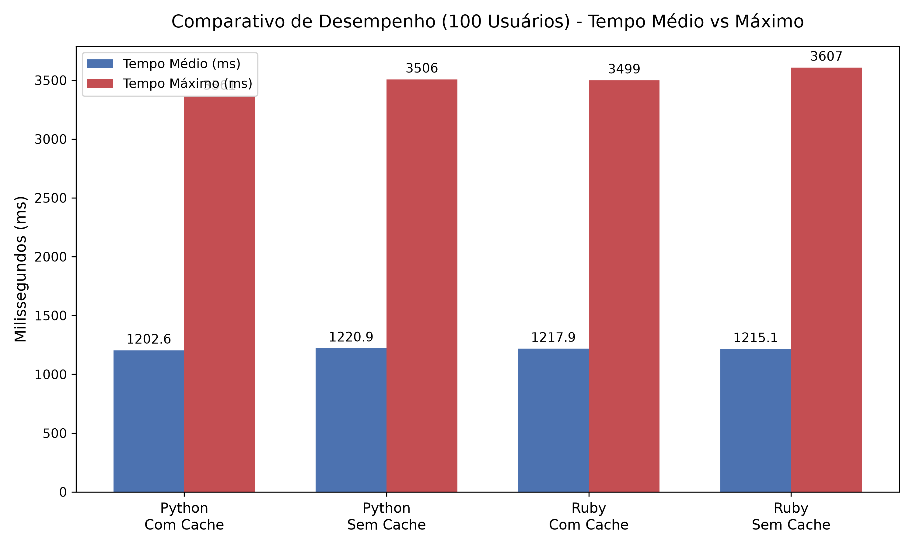

# 📊 Análise de Desempenho - Link Extractor

Este repositório documenta a infraestrutura e os resultados dos testes de carga realizados na aplicação **Link Extractor**, desenvolvida como projeto prático da disciplina de Computação Distribuída. 

O objetivo central foi avaliar o comportamento de diferentes tecnologias de backend (Python e Ruby) sob estresse e medir o impacto arquitetural da introdução de uma camada de cache em memória (Redis).

---

## 🛠️ Metodologia de Testes e Infraestrutura

A infraestrutura foi totalmente orquestrada utilizando **Docker Compose** para garantir o isolamento do ambiente (APIs, Base de Dados e Redis). Os testes de carga foram executados com a ferramenta **Locust**, aplicando um *ramp-up* progressivo:
* Carga Leve: 10 utilizadores (1/s)
* Carga Média: 50 utilizadores (2/s)
* Carga Máxima: 100 utilizadores (3/s)

### 🔄 Configuração de URLs e Comutação (Python vs. Ruby)
A aplicação recebe uma URL alvo como parâmetro de entrada. Para isolar as métricas de cada linguagem sem alterar o script de carga (`locustfile.py`), o tráfego gerado pelo Locust foi redirecionado para as portas específicas expostas pelo Docker Compose na rede local (`http://127.0.0.1`). O proxy encarregou-se de encaminhar a carga para o contentor correto, permitindo testar o Python e o Ruby de forma estritamente independente, através de requisições `GET` repetitivas.

### 🧠 Controlo do Cache (Redis)
Os testes "Com e Sem Cache" validaram o comportamento da infraestrutura. Com o Redis ativo, a primeira requisição do Locust a uma URL processava a página e guardava-a em memória; as milhares de requisições seguintes eram entregues quase instantaneamente pelo Redis. No cenário "Sem Cache", o contentor do Redis foi ignorado, forçando as APIs a recalcular a extração de links a cada nova requisição, o que gerou sobrecarga de CPU e picos de latência.

---

## 📊 Visão Geral do Desempenho (Carga Máxima: 100 Utilizadores)

Para ilustrar o impacto do cache, o gráfico abaixo compara o **Tempo Médio** e o **Tempo Máximo** de resposta (em milissegundos) dos quatro cenários sob a carga máxima de estresse.

*(Nota: Embora as médias globais convirjam para ~1200 ms, a ausência da camada de cache provocou picos de latência máxima visivelmente superiores nos Cenários 2 e 4, exigindo muito mais poder de processamento bruto dos servidores durante as rajadas de tráfego).*

---

## 📈 Análise Detalhada por Cenário (10, 50 e 100 Utilizadores)

Para compreender a resiliência do sistema, analisamos o comportamento das APIs desde a carga inicial (*cold start*) até a saturação. 

### 🟢 Cenário 1: Python COM Cache (Redis)
A API em Python operou com eficiência, delegando a resposta de consultas repetidas para a memória em vez de recalcular as respostas.

**🔹 Carga Leve (10 Utilizadores)**
| Total de Requisições | Falhas | Mediana (ms) | P95% (ms) | Média (ms) | Máximo (ms) |
| :---: | :---: | :---: | :---: | :---: | :---: |
| 10 | 0 | 3300.00 | 3500 | 3343.67 | 3519 |

**🔹 Carga Média (50 Utilizadores)**
| Total de Requisições | Falhas | Mediana (ms) | P95% (ms) | Média (ms) | Máximo (ms) |
| :---: | :---: | :---: | :---: | :---: | :---: |
| 3437 | 0 | 1011.60 | 3300 | 1390.29 | 3361 |

**🔹 Carga Máxima (100 Utilizadores)**
| Total de Requisições | Falhas | Mediana (ms) | P95% (ms) | Média (ms) | Máximo (ms) |
| :---: | :---: | :---: | :---: | :---: | :---: |
| 11576 | 0 | 1011.28 | 1900 | 1202.60 | 3361 |

---

### 🔴 Cenário 2: Python SEM Cache
Sem a proteção da memória, o servidor precisou reprocessar integralmente cada requisição. A carga média já evidencia o esforço computacional contínuo.

**🔹 Carga Leve (10 Utilizadores)**
| Total de Requisições | Falhas | Mediana (ms) | P95% (ms) | Média (ms) | Máximo (ms) |
| :---: | :---: | :---: | :---: | :---: | :---: |
| 581 | 0 | 3300.00 | 3300 | 3098.29 | 3840 |

**🔹 Carga Média (50 Utilizadores)**
| Total de Requisições | Falhas | Mediana (ms) | P95% (ms) | Média (ms) | Máximo (ms) |
| :---: | :---: | :---: | :---: | :---: | :---: |
| 5771 | 0 | 1013.68 | 3300 | 1390.62 | 3372 |

**🔹 Carga Máxima (100 Utilizadores)**
| Total de Requisições | Falhas | Mediana (ms) | P95% (ms) | Média (ms) | Máximo (ms) |
| :---: | :---: | :---: | :---: | :---: | :---: |
| 13251 | 0 | 1014.24 | 1900 | 1220.91 | 3506 |

---

### 🟢 Cenário 3: Ruby COM Cache (Redis)
O melhor volume de requisições consolidadas ocorreu neste ambiente. A estabilidade na carga média e máxima demonstrou excelente sinergia entre o Ruby e o Redis.

**🔹 Carga Leve (10 Utilizadores)**
| Total de Requisições | Falhas | Mediana (ms) | P95% (ms) | Média (ms) | Máximo (ms) |
| :---: | :---: | :---: | :---: | :---: | :---: |
| 594 | 0 | 3300.00 | 3300 | 3118.65 | 3369 |

**🔹 Carga Média (50 Utilizadores)**
| Total de Requisições | Falhas | Mediana (ms) | P95% (ms) | Média (ms) | Máximo (ms) |
| :---: | :---: | :---: | :---: | :---: | :---: |
| 4892 | 0 | 1011.49 | 3300 | 1380.94 | 3364 |

**🔹 Carga Máxima (100 Utilizadores)**
| Total de Requisições | Falhas | Mediana (ms) | P95% (ms) | Média (ms) | Máximo (ms) |
| :---: | :---: | :---: | :---: | :---: | :---: |
| 15365 | 0 | 1011.21 | 1900 | 1217.94 | 3499 |

---

### 🔴 Cenário 4: Ruby SEM Cache
Neste cenário, a API em Ruby absorveu diretamente todo o estresse. Observa-se que, apesar de manter 0% de falhas, as latências máximas foram empurradas aos limites do teste.

**🔹 Carga Leve (10 Utilizadores)**
| Total de Requisições | Falhas | Mediana (ms) | P95% (ms) | Média (ms) | Máximo (ms) |
| :---: | :---: | :---: | :---: | :---: | :---: |
| 489 | 0 | 3300.00 | 3400 | 3185.40 | 3720 |

**🔹 Carga Média (50 Utilizadores)**
| Total de Requisições | Falhas | Mediana (ms) | P95% (ms) | Média (ms) | Máximo (ms) |
| :---: | :---: | :---: | :---: | :---: | :---: |
| 5962 | 0 | 1011.43 | 3300 | 1374.35 | 3715 |

**🔹 Carga Máxima (100 Utilizadores)**
| Total de Requisições | Falhas | Mediana (ms) | P95% (ms) | Média (ms) | Máximo (ms) |
| :---: | :---: | :---: | :---: | :---: | :---: |
| 12741 | 0 | 1011.13 | 1900 | 1215.09 | 3607 |

---

## 📝 Conclusões Finais

Ambas as linguagens de programação mantiveram a total integridade do sistema, alcançando a marca de 0% de falhas (*fails*) durante as fases de estresse prolongado. No entanto, a análise pormenorizada de cada etapa de carga consolida a tese de que o **Redis atua como um escudo computacional imprescindível**. 

A ausência de uma base de dados em memória para mitigar o reprocessamento de leituras elevou drasticamente as latências máximas nos picos de acesso, independentemente da linguagem. Em sistemas distribuídos modernos, otimizações arquiteturais e a correta aplicação de componentes de cache trazem um impacto muito mais profundo na resiliência e na experiência do utilizador final do que a mera escolha da linguagem de desenvolvimento da API.

---
**Autor:** Alípio Fernando Gonçalves Rollo Júnior (Matrícula: 2320422/3)  
**Curso:** Ciência da Computação